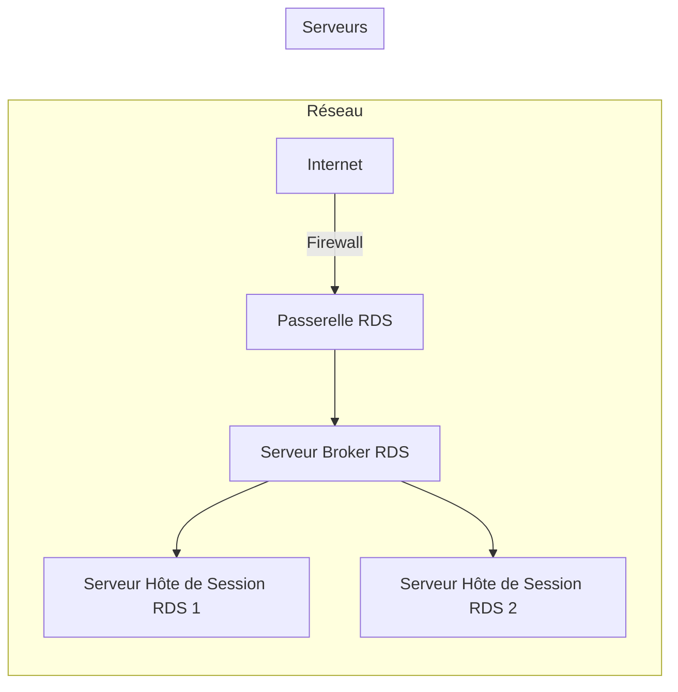

```mermaid
graph LR
    subgraph Réseau
        Internet --> |Firewall| RDS-Gateway
        RDS-Gateway --> RDS-Broker
        RDS-Broker --> RDS-Session-Host-1
        RDS-Broker --> RDS-Session-Host-2
    end
    subgraph Serveurs
        RDS-Gateway[Passerelle RDS]
        RDS-Broker[Serveur Broker RDS]
        RDS-Session-Host-1[Serveur Hôte de Session RDS 1]
        RDS-Session-Host-2[Serveur Hôte de Session RDS 2]
    end
```